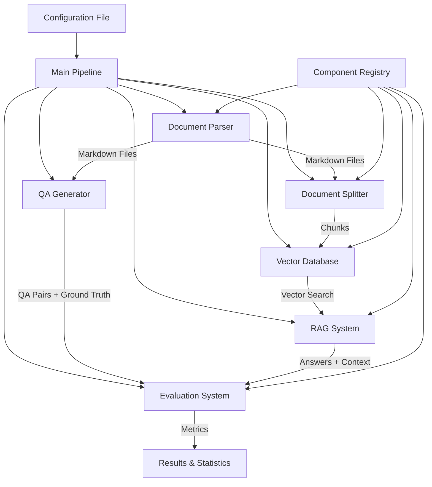
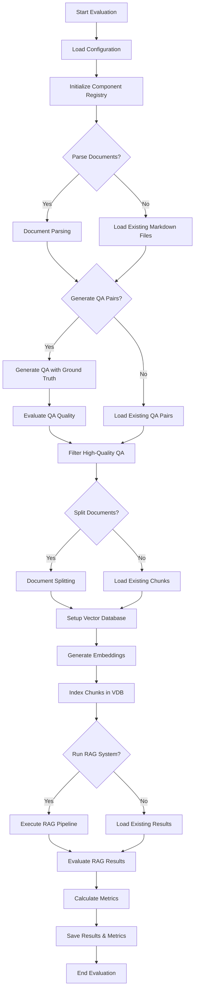
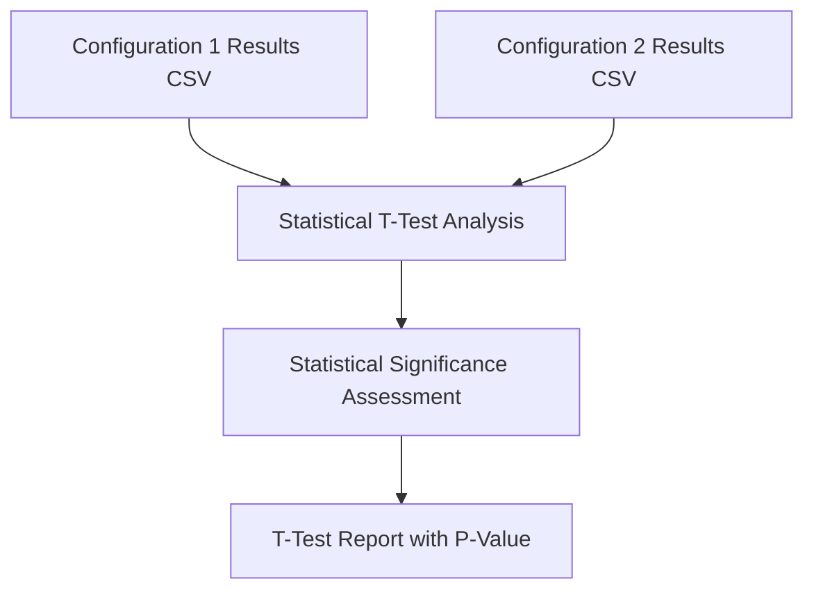

# System Patterns

## Design Patterns

### Registry Pattern
The framework uses a centralized Registry class to manage component registration and creation:
- **Component Registration**: All parsers, splitters, LLMs, embeddings, vector databases, and RAG implementations register through the Registry
- **Factory Methods**: Registry provides factory methods to create instances of registered components
- **Extensibility**: New components can be easily added without modifying core framework code

### Strategy Pattern
Different implementations of the same interface are interchangeable:
- **Document Parsers**: DoclingParser, MarkItDownParser
- **Document Splitters**: LangchainMDSplitter, SemanticMDSplitter, DoclingMDSplitter
- **Vector Databases**: MilvusLiteDB, MilvusDB, ElasticSearchDB, MilvusHybridDB
- **RAG Implementations**: SimpleRAG (extensible for more complex approaches)

### Configuration-Driven Architecture
The entire pipeline is driven by JSON configuration files:
- **Declarative Configuration**: All components and their settings defined in config.json
- **Conditional Execution**: Each pipeline stage can be enabled/disabled via configuration
- **Parameter Flexibility**: Component-specific settings passed through extra_settings

## System Architecture



## Workflow Graph



## Statistical Analysis Workflow



## Project Structure

```
rag_evaluation/
├── config/              # Configuration models and validation
├── dataset/             # QA generation and evaluation components
├── evaluator/           # Evaluation metrics (RAGAS + custom: HitK, ContextSufficiency)
├── ground_truth/        # Ground truth generation and management
├── kb/                  # Vector database implementations
├── llm/                 # Language model interfaces
├── parser/              # Document parsing utilities
├── prompts/             # Prompt templates for LLM interactions
├── rags/                # RAG implementation strategies
├── splitter/            # Document chunking strategies
└── utils/               # Utility functions and helpers

data/
├── configs/             # Vector database specific configurations
├── mds/                 # Parsed markdown files and metadata
└── source/              # Original source documents

scripts/                 # Utility scripts for setup and analysis
```

## Component Dependencies

### Input/Output Schema

**Document Parser**
- Input: File paths, URLs, parser configuration
- Output: Markdown files with metadata (title, sections, headers)

**QA Generator**
- Input: Markdown chunks, LLM configuration
- Output: QA pairs with language, ground truth, and quality scores

**Document Splitter**
- Input: Markdown files, chunking configuration
- Output: Structured chunks with metadata (id, document_id, sequence_num, content)

**Vector Database**
- Input: Document chunks, embedding model, database configuration
- Output: Indexed vector database, search capabilities

**RAG System**
- Input: Questions, vector database, LLM configuration
- Output: Answers with retrieved contexts and relevance scores

**Evaluator**
- Input: Questions, generated answers, expected answers, retrieved contexts
- Output: Comprehensive metrics (RAGAS + custom metrics: HitK, ContextSufficiency, etc.)

**Statistical Analyzer**
- Input: Two CSV metric files, column name for comparison
- Output: T-test results, statistical significance assessment, confidence analysis

### Component Flow

1. **Registry → Components**: Factory pattern creates configured instances
2. **Parser → Splitter**: Markdown files flow to chunking system
3. **Parser → QA Generator**: Markdown content used for QA generation
4. **Splitter → Vector DB**: Chunks indexed with embeddings
5. **Vector DB → RAG**: Provides retrieval capabilities
6. **QA Generator → Evaluator**: Provides ground truth for evaluation
7. **RAG → Evaluator**: Provides generated answers and contexts
8. **Evaluator → Results**: Produces final metrics and analysis
9. **Results → Statistical Analyzer**: CSV metrics files used for statistical comparison between configurations

## Multiple Configuration Support

The framework supports running multiple configurations for comparative analysis:
- **config.json**: Base configuration with default chunking strategy
- **config_langchain.json**: Configuration optimized for Langchain-based chunking
- **config_semantic.json**: Configuration optimized for semantic chunking
- **Comparative Analysis**: Results can be statistically compared using t-test.py
