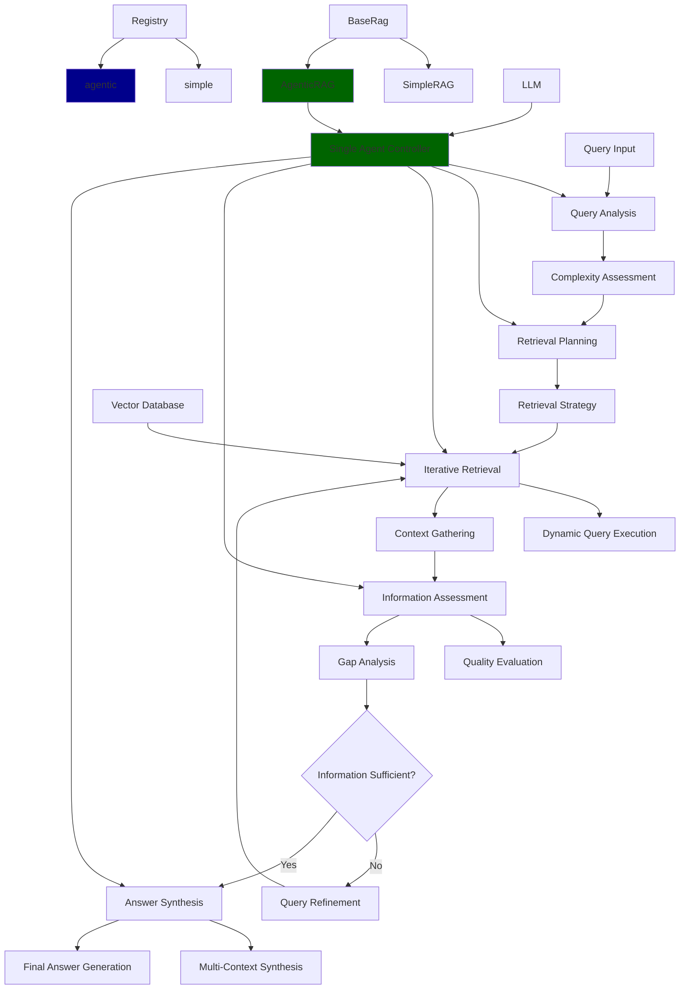
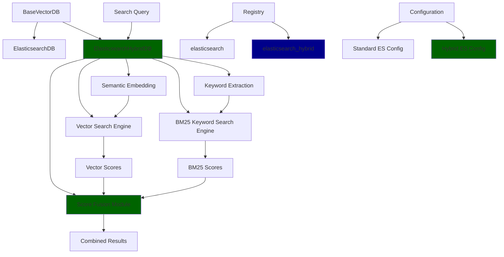

# Tasks

## Task #002

#### Task ID
T-002

#### Task Status
New

#### Task Description
Implement Agentic RAG (Retrieval-Augmented Generation) system that uses a single intelligent agent to dynamically plan, reason, and execute iterative retrieval and generation tasks.

The problem being solved: Current SimpleRAG implementation uses a fixed, single-step retrieval approach that doesn't adapt to complex queries requiring multiple information sources, iterative reasoning, or dynamic query refinement. Agentic RAG employs a single intelligent agent that can:
- Analyze query complexity and plan retrieval strategies
- Iteratively retrieve and assess information quality
- Dynamically refine queries based on initial results
- Synthesize information from multiple retrieval rounds
- Self-correct when information is insufficient

This task fits into the overall project by extending the RAG evaluation framework with agentic capabilities, enabling evaluation of more sophisticated RAG systems that can handle complex queries requiring iterative reasoning and planning.

Dependencies: Requires existing BaseRag interface, SimpleRAG as reference implementation, and the Registry pattern for component registration. Also depends on existing LLM infrastructure for agent reasoning.

#### Files to Modify
Files to create:
1. `rag_evaluation/rags/agentic_rag.py` - New agentic RAG implementation with single agent
2. `rag_evaluation/rags/agent_tools.py` - Helper tools for agent reasoning and planning

Files to modify:
1. `rag_evaluation/registery.py` - Register new agentic RAG component
2. `rag_evaluation/rags/__init__.py` - Export new agentic RAG class
3. `eval_rag.py` - Register agentic RAG component in initialization

#### Design Flowchart

#### Implementation Details
Data structures to use:
- Inherit from BaseRag for consistency with existing interface
- Implement single agent controller with integrated reasoning capabilities
- Use planning data structures (retrieval state, iteration tracking)
- Implement retrieval history for context-aware refinement
- Use confidence scoring for information quality assessment

Algorithms to implement:
1. **Query Analysis**: Assess query complexity and determine if iterative approach is needed
2. **Retrieval Planning**: Plan initial retrieval strategy based on query characteristics
3. **Iterative Retrieval**: Execute retrieval rounds with dynamic query refinement
4. **Information Assessment**: Evaluate retrieved information quality and identify gaps
5. **Context Synthesis**: Combine information from multiple retrieval rounds

Key Components:
- **Agent Controller**: Central coordinator that manages the entire agentic process
- **Query Analyzer**: Determines query complexity and retrieval strategy
- **Retrieval Executor**: Handles dynamic, iterative retrieval with refinement
- **Information Evaluator**: Assesses retrieval quality and completeness
- **Answer Synthesizer**: Generates final answers from collected information

Integration points with existing code:
- Extend BaseRag abstract class
- Register with Registry using "agentic" name
- Use existing BaseVectorDB and BaseLanguageModel interfaces
- Follow existing configuration pattern with extra_settings

Key parameters:
- `max_iterations`: Maximum number of retrieval rounds (default: 3)
- `confidence_threshold`: Minimum confidence for final answer (default: 0.7)
- `complexity_threshold`: Threshold for determining if agentic approach is needed (default: 0.5)
- `retrieval_strategy`: Retrieval approach ("expand", "refine", "diversify")
- `enable_refinement`: Whether to enable query refinement (default: True)

#### Unit Tests
1. `test_agentic_rag_init()` - Test initialization with configuration
2. `test_query_analysis()` - Test query complexity analysis
3. `test_simple_query_passthrough()` - Test simple queries that bypass agentic behavior
4. `test_complex_query_processing()` - Test complex queries requiring iterative retrieval
5. `test_iterative_retrieval()` - Test multiple retrieval rounds with refinement
6. `test_information_assessment()` - Test retrieval quality evaluation
7. `test_context_synthesis()` - Test multi-context information combination
8. `test_confidence_evaluation()` - Test answer confidence assessment
9. `test_max_iterations_limit()` - Test maximum iteration constraints
10. `test_insufficient_information_handling()` - Test graceful handling of incomplete results
11. `test_integration_with_vector_db()` - Test integration with existing vector databases
12. `test_integration_with_llm()` - Test integration with existing LLM interfaces

## Task #001

#### Task ID
T-001

#### Task Status
Completed

#### Task Description
Implement Elasticsearch Hybrid Mode Knowledge Base that combines semantic vector search with BM25 keyword search for improved retrieval accuracy.

The problem being solved: Current Elasticsearch implementation only uses dense vector similarity search, missing the benefits of exact keyword matching. Hybrid search combines both approaches for better retrieval performance.

This task fits into the overall project by extending the existing vector database options in the RAG evaluation framework, allowing users to compare hybrid search performance against pure semantic search.

Dependencies: Requires existing ElasticsearchDB implementation as a base, and the Registry pattern for component registration.

#### Files to Modify
Files to create:
1. `rag_evaluation/kb/elasticsearch_hybrid_db.py` - New hybrid DB implementation
2. `data/configs/elasticsearch_hybrid_config.json` - Configuration template
3. `tests/test_elasticsearch_hybrid_db.py` - Unit tests

Files to modify:
1. `rag_evaluation/registery.py` - Register new hybrid DB component
2. `rag_evaluation/kb/__init__.py` - Export new class

#### Design Flowchart

#### Implementation Details
Data structures to use:
- Inherit from BaseVectorDB for consistency
- Use Elasticsearch's hybrid search capabilities with both dense_vector and text fields
- Implement score fusion using Reciprocal Rank Fusion (RRF) or weighted combination

Algorithms to implement:
1. Hybrid search execution: Run both vector and BM25 searches in parallel
2. Score normalization: Normalize scores from different search types
3. Reciprocal Rank Fusion: Combine rankings using RRF formula
4. Weighted combination: Linear combination of normalized scores

Integration points with existing code:
- Extend BaseVectorDB abstract class
- Register with Registry using "elasticsearch_hybrid" name
- Use existing BaseEmbeddings interface for vector generation
- Follow existing configuration pattern with extra_settings

Key parameters:
- `semantic_weight`: Float (0.0-1.0) for vector search weight
- `keyword_weight`: Float (0.0-1.0) for BM25 search weight  
- `fusion_method`: String ("rrf", "weighted_sum", "max")
- `rrf_k`: Integer parameter for RRF calculation (default: 60)

#### Unit Tests
1. `test_elasticsearch_hybrid_db_init()` - Test initialization with configuration
2. `test_add_documents()` - Test document insertion with both vector and text fields
3. `test_search_vector_only()` - Test pure vector search functionality
4. `test_search_keyword_only()` - Test pure BM25 search functionality
5. `test_search_hybrid_rrf()` - Test RRF score fusion
6. `test_search_hybrid_weighted()` - Test weighted score combination
7. `test_search_hybrid_max()` - Test max score fusion
8. `test_reset_collection()` - Test collection reset functionality
9. `test_batch_operations()` - Test batch insert and search operations
10. `test_configuration_validation()` - Test configuration parameter validation
