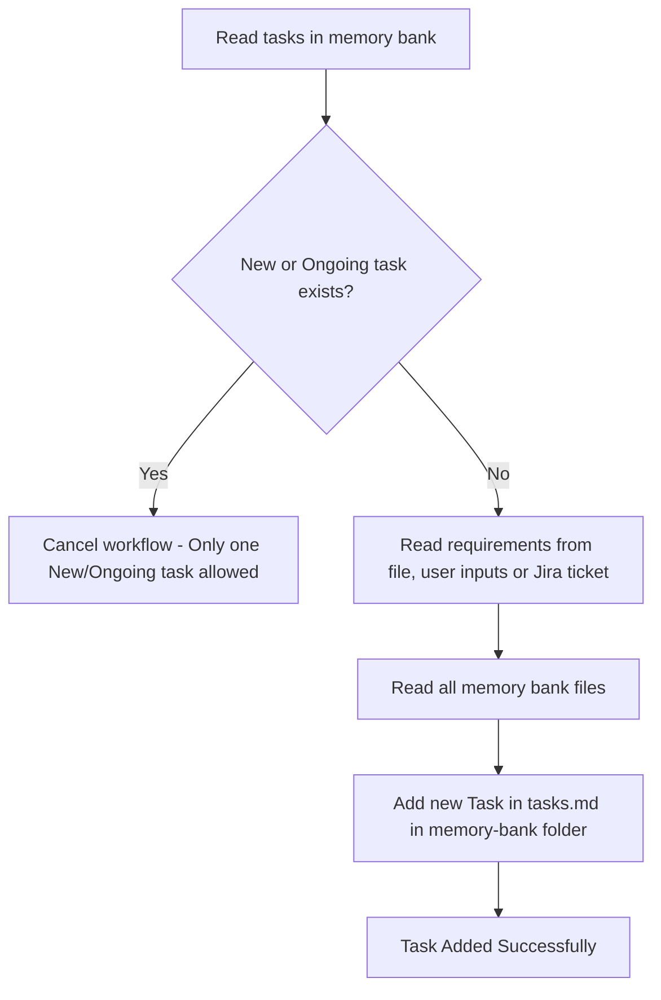
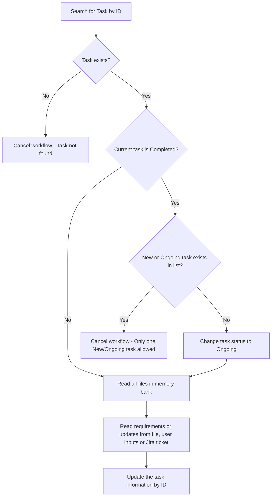
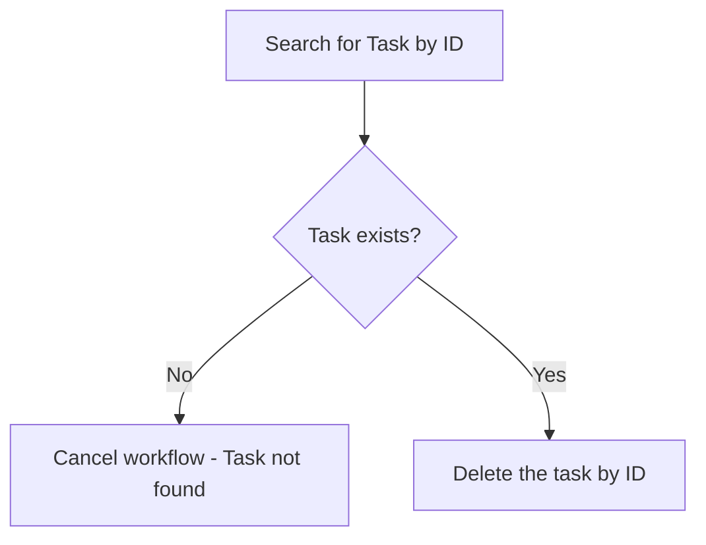
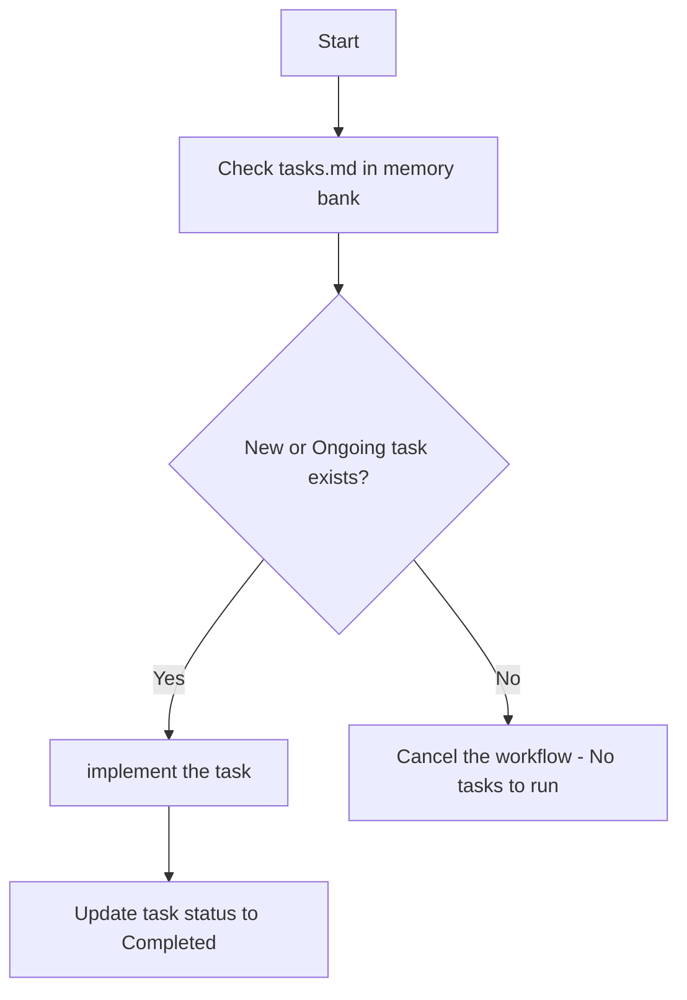

## Task Manager

You are an expert Software Engineer tasked with managing active tasks based on the requirements and memory bank using `tasks.md` in memory bank.
Create the document if not exists, each task should be in following format:

### Format

#### Task ID
- Generate unique ID for the task

#### Task Status
- [New, Ongoing, Completed]

#### Task Description
[Detailed explanation of what needs to be implemented, including:

- The problem being solved
- How this task fits into the overall project
- Any dependencies on other components]

#### Files to Modify
[List the specific files that:

- need to be created, maximum 5
- need to be modified]

#### Design Flowchart
[Generate a flowchart (using mermaid flowchart TD syntax):

- Show the project architecture with new classes or components in dark green boxes
- Highlight the new/updated classes or components in the chart in dark blue boxes]

#### Implementation Details
[Provide specific implementation guidance, including:

- Data structures to use
- Algorithms to implement
- Integration points with existing code]

#### Unit Tests
[List the unit tests that should be written to verify the implementation]


### Example Task:

```markdown
# Tasks

## Task #001

#### Task ID
T-001

#### Task Status
New

#### Task Description
Implement Elasticsearch Hybrid Mode Knowledge Base that combines semantic vector search with BM25 keyword search for improved retrieval accuracy.

The problem being solved: Current Elasticsearch implementation only uses dense vector similarity search, missing the benefits of exact keyword matching. Hybrid search combines both approaches for better retrieval performance.

This task fits into the overall project by extending the existing vector database options in the RAG evaluation framework, allowing users to compare hybrid search performance against pure semantic search.

Dependencies: Requires existing ElasticsearchDB implementation as a base, and the Registry pattern for component registration.

#### Files to Modify
Files to create:
1. `rag_evaluation/kb/elasticsearch_hybrid_db.py` - New hybrid DB implementation
2. `data/configs/elasticsearch_hybrid_config.json` - Configuration template
3. `tests/test_elasticsearch_hybrid_db.py` - Unit tests

Files to modify:
1. `rag_evaluation/registery.py` - Register new hybrid DB component
2. `rag_evaluation/kb/__init__.py` - Export new class

#### Design Flowchart
{{```mermaid
flowchart TD
    A[BaseVectorDB] --> B[ElasticsearchDB]
    A --> C[ElasticsearchHybridDB]
    C --> D[Vector Search Engine]
    C --> E[BM25 Keyword Search Engine]
    C --> F[Score Fusion Module]
    
    G[Registry] --> H[elasticsearch]
    G --> I[elasticsearch_hybrid]
    
    J[Configuration] --> K[Standard ES Config]
    J --> L[Hybrid ES Config]
    
    M[Search Query] --> C
    C --> N[Semantic Embedding]
    C --> O[Keyword Extraction]
    N --> D
    O --> E
    D --> P[Vector Scores]
    E --> Q[BM25 Scores]
    P --> F
    Q --> F
    F --> R[Combined Results]
    
    style C fill:#006400
    style F fill:#006400
    style I fill:#00008B
    style L fill:#006400
```}}

#### Implementation Details
Data structures to use:
- Inherit from BaseVectorDB for consistency
- Use Elasticsearch's hybrid search capabilities with both dense_vector and text fields
- Implement score fusion using Reciprocal Rank Fusion (RRF) or weighted combination

Algorithms to implement:
1. Hybrid search execution: Run both vector and BM25 searches in parallel
2. Score normalization: Normalize scores from different search types
3. Reciprocal Rank Fusion: Combine rankings using RRF formula
4. Weighted combination: Linear combination of normalized scores

Integration points with existing code:
- Extend BaseVectorDB abstract class
- Register with Registry using "elasticsearch_hybrid" name
- Use existing BaseEmbeddings interface for vector generation
- Follow existing configuration pattern with extra_settings

Key parameters:
- `semantic_weight`: Float (0.0-1.0) for vector search weight
- `keyword_weight`: Float (0.0-1.0) for BM25 search weight  
- `fusion_method`: String ("rrf", "weighted_sum", "max")
- `rrf_k`: Integer parameter for RRF calculation (default: 60)

#### Unit Tests
1. `test_elasticsearch_hybrid_db_init()` - Test initialization with configuration
2. `test_add_documents()` - Test document insertion with both vector and text fields
3. `test_search_vector_only()` - Test pure vector search functionality
4. `test_search_keyword_only()` - Test pure BM25 search functionality
5. `test_search_hybrid_rrf()` - Test RRF score fusion
6. `test_search_hybrid_weighted()` - Test weighted score combination
7. `test_search_hybrid_max()` - Test max score fusion
8. `test_reset_collection()` - Test collection reset functionality
9. `test_batch_operations()` - Test batch insert and search operations
10. `test_configuration_validation()` - Test configuration parameter validation
```


### Task list management
- Only keep last three Completed tasks, remove completed task if needed
- Only keep have one New or Ongoing task, Cancel adding New Task if there's New or Ongoing task


## Workflows

### Add Task


### Update Task


### Delete Task by ID


### Run Task
